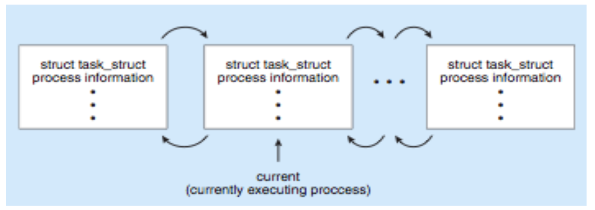

# 3. 프로세스

---

## 3.1 프로세스 개념

### 프로세스(Process)란?

 * 직관적으로는 실행중인 프로그램 (a program in execution)

   > 프로그램: 명령어 리스트를 내용으로 가진 디스크에 저장된 파일 그 자체	passive entity
   >
   > 프로세스: 프로그램 카운터와 관련 자원의 집합, 실행 파일(executable file)이 메모리에 적재될 때 프로세스가 됨	active entity

###프로세스 상태 (Process State)

**어느 한 순간에 한 처리기상에서는 오직 하나의 프로세스만이 실행(running)된다!**

### 프로세스 제어 블록 (Process Control Block, PCB)

 * 운영체제가 프로세스 관련 정보를 저장하는 자료구조

   >Process State
   >
   >Process Number: PID
   >
   >Program Counter: process's next instructions address
   >
   >Registers: registers & condition code. 인터럽트 발생시 저장되어야 함.
   >
   >...

* Linux에서 PCB는 커널 소스코드 디렉토리에 있는 <linux/sched.h> 헤더 안에서 C 구조체 task_struct로 표현된다.

~~~c
struct task_struct{
	pid_t pid; /* process identifier */
	long state; /* state of the process */
	unsigned_int time_slice /* scheduling information */ 
  struct task_struct *parent; /* this process’s parent */ 
  struct list_head children; /* this process’s children */ 
  struct files_struct *files; /* list of open files */ 
  struct mm_struct *mm; /* address space of this process */
};
~~~

Linux 커널 안에서 모든 활성 프로세스들은 아래 그림과 같이 이중 연결 리스트 (Doubly linked list)로 표현된다.

### 스레드(Threads)

**프로세스 내에서 실행되는 흐름의 단위** (Multiple program counter per process)

> 여러 흐름이 동시에 진행되는…
>
> > 멀티 프로세스: 각 프로세스는 독립적으로 실행되며 별개의 메모리를 사용
> >
> > 멀티 스레드: 프로세스 내의 메모리 공유해서 사용 가능, 멀티 프로세스보다 전환속도가 빠름

---

##3.2 프로세스 스케줄링(Process Scheduling)

* CPU 사용을 최대한 효율적으로 해주려면 항상 CPU에서 어떤 프로세스가 실행되도록 time-sharing이 이루어져야한다.

* 프로세스 스케줄링(Process Scheduling)이란 CPU를 사용하려고 하는 <u>프로세스들 사이의 우선 순위를 관리하는 일</u>이다.
* 프로세스 스케줄러(Process Scheduler)는 CPU에서 다음에 실행할 프로세스를 활성 프로세스들중에서 골라주는 역할을 한다.

### 스케줄링 큐(Scheduling Queues)

> Job Queue: 시스템에 있는 모든 프로세스들의 집합
>
> Ready Queue: 메모리에 있으면서 CPU에서 실행되기를 대기하는 프로세스들의 집합
>
> Device Queue: I/O device를 대기하는 프로세스들의 집합

큐잉 도표(Queuing diagram)는 큐, 자원과 흐름을 표현한다.

프로세스가 종료되면 모든 큐에서 삭제되고, PCB와 자원을 반납(deallocate)한다.

프로세스가 ready queue에서 실행을 위하여 선택되는 것을 CPU에 할당(dispatch)된다고 한다.

### 스케줄러(Schedulers)

* 프로세스를 Queue에서 선택해주는 역할

**장기 스케줄러(Long-term scheduler, job scheduler)**: Ready queue로 올 프로세스(메모리에 로드될 프로세스)를 선택, 실행빈도 $\downarrow​$ (초, 분)

* 다중 프로그래밍 정도(degree of multiprogramming)를 조절한다.
* 다중 프로그래밍 정도가 안정적이면...
  * 평균 프로세스 생성률 == 평균 프로세스 이탈률
* 신중하게 선택하여야 한다
  * 입출력 중심 프로세스(I/O-bound process)들과 CPU 중심 프로세스(CPU-bound process)들이 적절히 혼합된 프로세스 혼합(Process mix)을 선택해야함
    * 시스템의 균형을 위해...

**단기 스케줄러(Short-term scheduler, CPU scheduler)**: 실행될 프로세스를 ready queue로부터 선택 실행빈도 $\uparrow$(밀리초)

* CPU를 위해 반드시 자주 새로운 프로세스를 선택해야한다.
* 실행 간격이 짧기 때문에, 엄청 빨라야 한다.

**중기 스케줄러(Midium-term scheduler)**: 메모리에서 프로세스들을 제거해 다중프로그래밍 정도를 완화함

* 메모리에서 프로세스를 지우고 디스크에 저장한 다음, 다시 디스크에서 메모리로 불러오고 알맞은 지점에서 실행을 재개한다. (스와핑 Swapping)

 ### 문맥 교환(Context Switch)

* CPU에서 실행되는 프로세스를 바꾸어야 할때, 시스템은 우선 기존의 프로세스 상태를 저장하고(State save), 실행할 프로세스의 상태를 문맥 교환(Context switch)를 통해 복구해야한다(State restore).

* 프로세스의 문맥(Context)는 PCB로 표현된다.
* 문맥교환 시간은 순수한 오버해드(overhead)이다.

---

## 3.3 프로세스에 대한 연산(Operation on Processes)

### 프로세스 생성(Process Creation)

* 부모 프로세스(Parent process)는 자식 프로세스(Child process)를 생성하고, 이렇게 새로 생성된 프로세스들은 각각 다시 다른 프로세스를 생성할 수 있으며, 프로세스의 트리(tree of processes)가 형성된다.

* 운영체제들은 프로세스를 프로세스 식별자(process identifier, pid)를 통해 구분한다.

Resource sharing options

- 부모와 자식이 모든 자원 공유
- 부모의 일부 자원만 자식과 공유
- 부모와 자식이 자원을 공유하지 않음

Execution options

* 부모와 자식이 cocurrently하게 실행
* 부모가 자식이 종료될때까지 wait

Address space options

* 자식이 부모의 복사본(똑같은 프로그램과 데이터)
* 자식이 자신에게 load(적재)될 새로운 프로그램을 가지고 있다

#### Unix의 경우...

* fork()는 새 프로세스를 만든다.

* exec()는 프로세스의 메모리에 새 프로그램을 올리기 위해 fork()이후에 사용된다.

### 프로세스 종료(Process Termination)

##### 프로세스는 마지막 문장의 실행을 끝내고, exit 시스템 호출을 하여 운영체제에게 자신의 삭제를 요청하며 종료한다.

* 자식은 wait()을 통하여 부모에게 상태값을 반환 가능
* 자원들은 운영체제에 의해 deallocate된다

##### 부모는 자식을 종료시킬 수 있다

* 자식이 자신에게 할당된 자원을 초과하여 사용할 경우
* 자식에게 할당된 task가 더 이상 필요 없을 경우
* 부모가 exit하는데 운영체제가 부모가 exit한 후 자식의 실행을 허용하지 않는 경우
  * 모든 자식들이 종료되어야 함.  &Rightarrow; 연쇄식 종료(cascading termination)

~~~c
pid_t pid;
int status;
pid = wait(&status);
~~~

* 좀비 프로세스(Zombie): 종료되었지만 부모가 아직 wait 호출을 하지 않은 프로세스
* 고아 프로세스(Orphan): 부모가 wait 호출을 하지 않고 종료한 프로세스

---

## 프로세스간 통신(Interprocess Communication)

* 운영체제 내에서 실행되는 프로세스들은 독립적(independent)이거나 협력적(cooperating)일 수 있다
* 데이터 공유(data sharing)을 포함해 다른 프로세스에 영향을 주거나 영향을 받는 프로세스가 협력적인 프로세스이다.

##### 협력적인 프로세스(cooperating process)

* 정보 공유(Information sharing)
* 계산 가속화(Computation speedup): multi-core에서만 가능
* 모듈성(Modularity)
* 편의성(Convenience)

##### 프로세스간 통신(IPC)에는 두가지 모델이 있다

메시지 전달(Message Passing)과 공유 메모리(Shared Memory)

### 공유 메모리(Shared Memory)

#### 생산자-소비자 문제(Producer-Consumer Problem)

협력적 프로세스의 페러다임이다.

생산자 프로세스(producer process)는 정보를 생산하고, 소비자 프로세스(consumer process)는 정보를 소비한다.

* 무한 버퍼(unbounded buffer): 버퍼의 크기에 제한이 없음.
  * 소비자는 버퍼가 비었을때 대기해야 한다.
  * 생산자는 항상 새 항목을 생산할 수 있다.
* 유한 버퍼(bounded buffer)
  * 소비자는 버퍼가 비었을때 대기해야 한다.
  * 생산자는 버퍼가 가득 찼을때 대기해야 한다.

Shared data

~~~ c
#define BUFFER_SIZE 10
typedef struct {
  ...
} item;
	item buffer[BUFFER_SIZE];
  int in = 0;
  int out = 0;
~~~

Producer

~~~c
item next_produced; while (true) {
  /* produce an item in next_produced */
  while (((in + 1) % BUFFER_SIZE) == out)
    ; /* do nothing */
  buffer[in] = next_produced;
  in = (in + 1) % BUFFER_SIZE;
}
~~~

Consumer

~~~c
item next_consumed;
while (true) {
	while (in == out)
; /* do nothing */ 
next_consumed = buffer[out];
	out = (out + 1) % BUFFER_SIZE;
/* consume the item in next_consumed */ }
~~~

버퍼크기-1만큼만 사용할 수 있다.

### 메시지 전달 시스템(Message-Passing Systems)

* 프로세스들이 통신하고 그들의 동작을 동기화할 수 있도록 허용해주는 기법을 제공
* 메시지 시스템(Message system): 공유 변수들에 의존하지 않고 프로세스간 통신하는 것

메시지 전달 facility는 최소 아래 두가지 연산을 제공한다

* send(msg): msg사이즈는 고정길이 혹은 가변길이
* receive(msg)

##### 만약 P와 Q가 통신을 하고 싶으면...

* 둘 사이에 통신연결(Communication link)가 설정되어야 한다.
* send와 receive로 메시지를 교환한다.

Communication link 구현

* Physical: 공유 메모리, 하드웨어 버스
* Logical
  * Direct/Indirect
  * Synchronous/Asynchronous
  * Automatic/Explicit buffering

#### Direct Communication

* 프로세스는 서로의 이름을 명시해야 한다
  * send (P, message): 프로세스 P에게 전송
  * receive(Q, message): 프로세스 Q로부터 수신

성질

* link가 자동적으로 구축됨
* link는 정확히 한쌍(2개)의 프로세스들과 연관(associated)
* 한 쌍의 프로세스들 사이에는 반드시 하나의 link 존재
* Unidirectional일 수도 있지만 보통Bi-directional

#### Indirect Communication

* 메일박스(mailbox)를 이용해 통신한다
  * send(A, message): mailbox A로 전송
  * receive(A, message): mailbox A로부터 수신
* 각 mailbox들은 고유한 번호를 가지고 있다
* 프로세스들은 mailbox를 공유해야지만 통신이 가능하다

연산

* 새 mailbox 생성
* mailbox로 send/receive
* mailbox 파괴

성질

* link는 공유하는 mailbox가 존재하는 프로세스들 사이에서 구축됨
* link는 여러 프로세스들과 연관이 되어있을 수도 있다
* 한 쌍의 프로세스들 사이에서 여러 link가 존재할 수 있음
* Unidirectional일 수도 있고 Bi-directional일 수도 있음

##### P1, P2, P3가 mailbox A를 공유한다고 가정하자...

1. P1이 A에 메시지를 전송

2. P2와 P3가 각각 A로로부터 receive를 실행

\>> 메시지 수신자는 누구…?

가능한 해결기법

* 하나의 link가 최대 두개의 프로세스까지만 연관될 수 있도록 허용
* receive연산을 한 순간에 최대 하나의 프로세스만 실행할 수 있도록 허용
* 시스템이 임의적으로 어떤 프로세스가 수신자가 될 지 선택하도록 허용 (송신자는 어느 프로세스가 수신자인지 알 수 있다.)

#### Synchronization

* blocking이나 non-blocking

Blocking (Synchronous)

* Blocking send: 송신하는 프로세스는 메시지가 수신될 때까지 봉쇄된다.
* Blocking receive: 유효한 메시지를 받을 수 있을때까지 수신 프로세스가 봉쇄된다

Non-blocking(Asynchronous)

* Non-blocking send: 송신하는 프로세스는 메시지를 송신한 후 계속한다.
* Non-blocking receive: 수신 프로세스는 유효한 메시지나 null을 수신한다.

만약 sender와 receiver 모두 blocking이라면, 송신자와 수신자간의 랑데뷰(rendezvous, 버퍼의 길이가 0)를 갖게 된다.

생산자-소비자 문제가 자명해진다.

~~~c
message next_produced;
while (true) {
/* produce an item in next_produced */
   send(next_produced); // blocking send
}
message next_consumed;
while (true) {
   receive(next_consumed); // blocking receive
   /* consume the item in next_consumed */
}
 
~~~

#### Buffering

* link에 queue가 붙어있음

구현 방식

* 무용량(Zero capacity)
  * 큐의 길이가 0이다
  * sender는 receiver를 기다려야함 (fkdepqb)
* 유한 용량(Bounded capacity)
  * 큐의 길이가 n(유한)이다
  * 큐가 가득차면 sender는 대기한다
* 무한 용향(unbounded capacity)
  * 큐의 길이에 제한이 없다
  * sender는 절대 대기하지 않는다 

